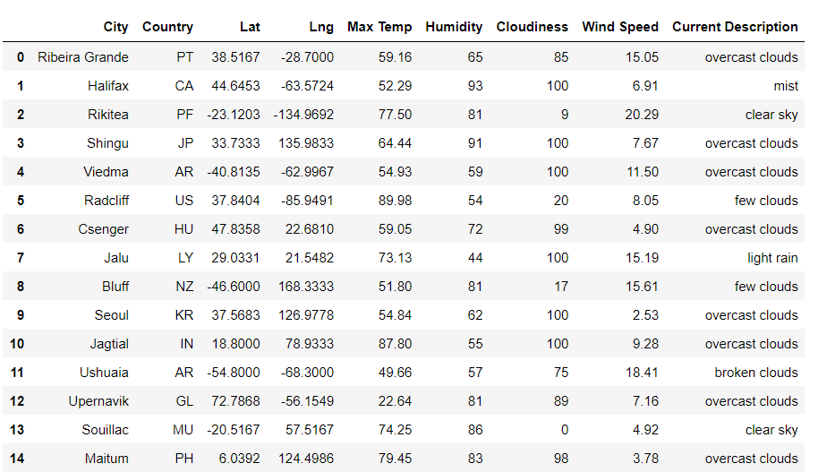
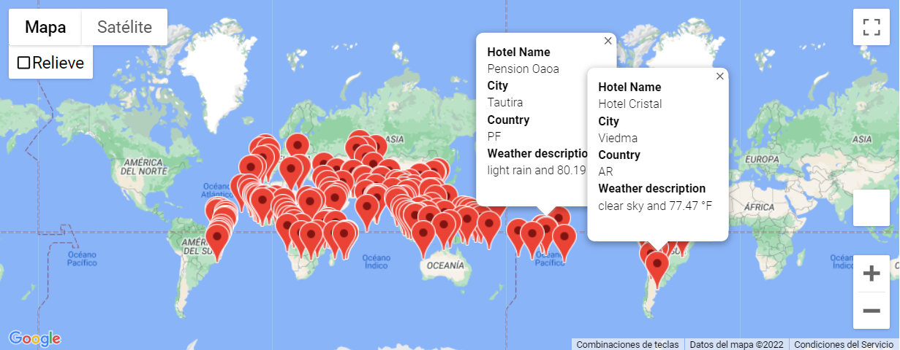
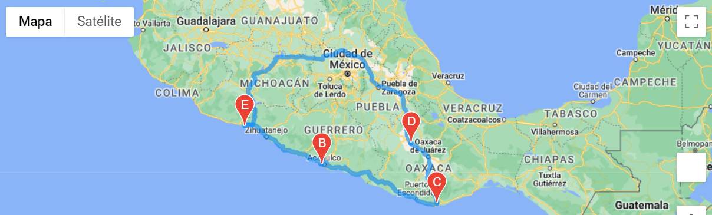
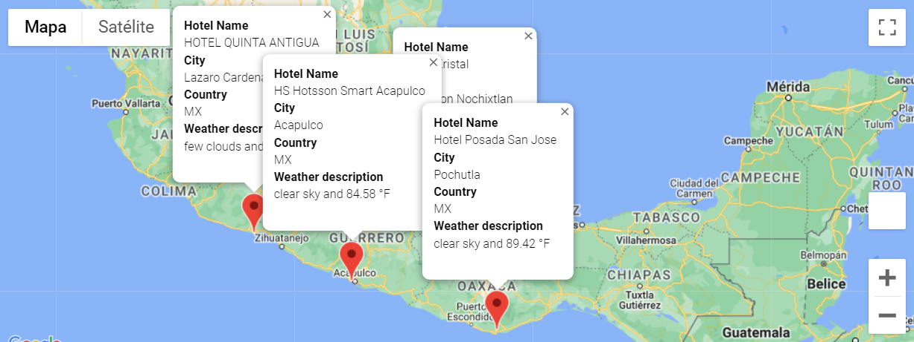

# Analyzing weather data using APIs

We'll be working with __PLANMYTRIP__ who's a top travel technology company that specializes in internet related services in the hotel and lodging industry. 
We will collect data from customers via the search page and filter based on their preferred travel criteria in order to find their ideal hotel anywhere. 
The tools used for this analysis are jupyter notebooks, pandas, matplotlib, numpy, citipy and API services from OpenWeather and Google.

## Overview

The database from the possible cities to visit was retrieved using the citipy module from python. A total of 760 cities were obtained.  
Then an API call was performed to the OpenWeather API to look for the cities and their description regarding latitude, longitude, max temperature, % humidity, cloudiness, wind speed, country and weather description. 
The information was saved in a dataframe and then exported to a csv file.

With the csv file obtained we perfomed an analysis to make sure the data was complete. After making sure there are no null values an API call was made using the Google API to find the nearest hotels in the locations we obtained. 
Finally a map was displayed showing all the locatios and their respective hotel's names, city, country and weather description as shown below.

From the cities obtained in the previous part, four cities where chosen to trace a route for a travel itinerary.  
The Google Directions API was used, the route was traced and also the description of the cities were displayed.

